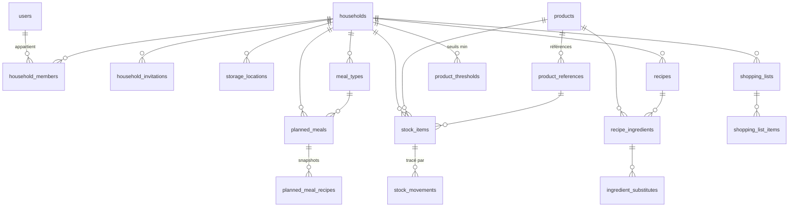

# Architecture technique

**Version :** 1.0 — 2026-07-03
**Référence fonctionnelle :** [`Spécification/spec.md`](../Spécification/spec.md) (v0.2)

Ce document décrit les choix d'architecture du projet. Il est le pendant technique de la
spécification fonctionnelle : toute règle métier fait foi dans la spec, ce document décrit
*comment* elle est implémentée.

---

## 1. Vue d'ensemble

L'application est composée de trois briques :

| Brique | Technologie | Rôle |
| --- | --- | --- |
| `apps/api` | AdonisJS 6 (Node.js, TypeScript) | API REST, logique métier, accès aux données |
| `apps/web` | Angular (TypeScript) + Tailwind CSS | PWA mobile-first, interface utilisateur |
| Base de données | PostgreSQL 17 | Persistance |

Principes directeurs (issus de la spec §9) :

- **Le serveur est la source de vérité.** Toute la logique métier (FIFO, agrégation des
  courses, conversions d'unités, snapshots) vit dans l'API. Le front est une couche de
  présentation qui peut fonctionner en lecture avec des données en cache.
- **Robustesse avant complexité** : monolithe modulaire, pas de micro-services. Le découpage
  en modules internes permet une extraction ultérieure si le besoin apparaît.
- **Traçabilité** : toute mutation du stock passe par un service unique qui écrit un
  mouvement de stock ; les autres actions significatives alimentent un journal d'activité.

## 2. Monorepo

```
Cooking/
├── Spécification/          # Spécification fonctionnelle (source de vérité métier)
├── docs/                   # Documentation technique (ce document, ADRs futurs)
├── apps/
│   ├── api/                # Backend AdonisJS
│   └── web/                # Frontend Angular (PWA)
├── docker/                 # Dockerfiles et configuration de déploiement
├── docker-compose.yml      # Environnement de développement (PostgreSQL)
└── README.md
```

Chaque application possède son propre `package.json` et son propre lockfile : pas de
workspaces npm (indépendance des dépendances, pas de conflits de hoisting). Les scripts
racine documentés dans le README orchestrent les deux applications.

## 3. Backend — AdonisJS

### 3.1 Organisation

Organisation par **modules métier** (et non par type technique) sous `app/` :

```
apps/api/app/
├── auth/                   # Inscription, connexion, tokens
├── households/             # Foyers, membres, invitations, emplacements, types de repas
├── catalog/                # Produits génériques, références commerciales, Open Food Facts
├── stock/                  # Entrées de stock, mouvements, FIFO
├── recipes/                # (Lot 2) Recettes, ingrédients, substituts
├── planning/               # (Lot 2) Repas planifiés, snapshots, validation
├── shopping/               # (Lot 3) Listes de courses, seuils minimums
├── nutrition/              # (Lot 4) Calculs nutritionnels, CIQUAL
├── recommendations/        # (Lot 4) Moteur de scoring
└── shared/                 # Unités & conversions, journal d'activité, helpers
```

Chaque module contient ses `controllers/`, `models/`, `services/`, `validators/`.
La logique métier vit dans les **services** ; les contrôleurs restent minces
(validation → appel de service → réponse).

### 3.2 Conventions API

- REST, JSON, préfixe **`/api/v1`**.
- Authentification par **access token opaque** (`auth_access_tokens` d'Adonis), transmis en
  header `Authorization: Bearer`.
- Les ressources d'un foyer sont **scopées par l'URL** :
  `/api/v1/households/:householdId/stock-items`. Un middleware vérifie l'appartenance de
  l'utilisateur au foyer et son rôle (`admin` > `member` > `viewer`).
- Validation systématique des entrées avec **VineJS** (règle 7.14 : validation stricte).
- Erreurs normalisées : `{ "errors": [{ "code": "...", "message": "...", "field": "..." }] }`.
- Pagination par curseur ou page/limite selon la ressource ; filtres en query string.

### 3.3 Authentification et autorisations

- Email / mot de passe (hash **scrypt**, natif Adonis).
- Un token d'accès par appareil, révocable (déconnexion).
- Rôles par foyer portés par `household_members.role` :
  - `admin` : gestion du foyer, des membres et invitations ;
  - `member` : toutes les actions du quotidien ;
  - `viewer` : lecture seule.
- Invitation par **code** à durée de validité limitée, révocable, générée par un admin.

### 3.4 Verrouillage optimiste (spec 7.8)

Les tables sujettes aux modifications concurrentes (stock, planning, listes de courses)
portent une colonne `version` incrémentée à chaque mise à jour. Le client renvoie la version
lue ; en cas de décalage l'API répond `409 Conflict` et le front propose un rafraîchissement.
Mise en place effective au Lot 2 (premier vrai risque de concurrence).

## 4. Modèle de données

Identifiants : **UUID** générés applicativement (pas d'entiers séquentiels exposés).
Horodatage : `created_at` / `updated_at` sur toutes les tables (UTC).
Quantités : `numeric(12,3)` (jamais de flottants binaires).
Unités : chaîne normalisée (`g`, `kg`, `ml`, `l`, `unit`, …) validée par le service d'unités.

### 4.1 Schéma cible (tous lots)



### 4.2 Tables — Lot 1

| Table | Colonnes principales | Notes |
| --- | --- | --- |
| `users` | email (unique), password, full_name, preferences (jsonb), nutrition_goals (jsonb) | préférences alimentaires et objectifs pour les lots 2/4 |
| `households` | name, settings (jsonb) | settings : unités préférées, mode automatique (Lot 4) |
| `household_members` | household_id, user_id, role (`admin`/`member`/`viewer`) | unicité (household, user) |
| `household_invitations` | household_id, code (unique), role, expires_at, revoked_at, created_by | code court partageable |
| `storage_locations` | household_id, name, type (`fridge`/`freezer`/`pantry`/`cellar`/`other`), description, position | seedés à la création du foyer, personnalisables |
| `meal_types` | household_id, name, default_time, position | seedés (petit-déjeuner 08:00, déjeuner 12:30, dîner 19:30), utilisés au Lot 2 |
| `products` | household_id (**nullable** : null = catalogue global), name, category, default_unit, unit_weight_grams, density_g_per_ml, nutrition_per_100 (jsonb), allergens (jsonb), ciqual_code | produit générique (spec §4.3) ; facteurs de conversion optionnels (spec §5.6) |
| `product_references` | product_id, barcode (unique), brand, name, package_quantity, package_unit, nutrition_per_100 (jsonb), image_url, shelf_life_days, source (`off`/`manual`) | référence commerciale (spec §4.4), alimentée par Open Food Facts ou saisie manuelle |
| `stock_items` | household_id, product_id, product_reference_id (nullable), quantity, unit, storage_location_id, status (`available`/`consumed`/`discarded`), added_at, expires_at, version | une ligne = un lot physique (spec §4.5) |
| `stock_movements` | household_id, stock_item_id, user_id, type (`added`/`consumed`/`discarded`/`corrected`/`moved`/`purchased`), quantity_delta, unit, context (jsonb) | **toute** mutation de stock écrit un mouvement ; `context` porte p. ex. l'id du repas validé |
| `activity_logs` | household_id, user_id, action, subject_type, subject_id, data (jsonb) | journal des actions non-stock (recettes, planning, courses) |

### 4.3 Tables — Lots 2 et 3 (anticipées, créées le moment venu)

| Table | Colonnes principales | Notes |
| --- | --- | --- |
| `recipes` | household_id, name, description, servings, prep_minutes, cook_minutes, steps (jsonb), tags (text[]), image_url, deleted_at | soft delete (spec 7.16) ; propriété du foyer, copie inter-foyers |
| `recipe_ingredients` | recipe_id, product_id, quantity, unit, optional (bool), position | |
| `ingredient_substitutes` | recipe_ingredient_id, product_id | |
| `planned_meals` | household_id, date, meal_type_id, time_override, status (`planned`/`done`/`cancelled`), version | l'heure effective = time_override ?? meal_type.default_time |
| `planned_meal_recipes` | planned_meal_id, recipe_id (nullable), servings, **snapshot (jsonb)** | snapshot = nom + ingrédients + quantités figés à la planification (spec 7.3) |
| `shopping_lists` | household_id, status (`active`/`completed`), generated_at, version | |
| `shopping_list_items` | shopping_list_id, product_id, product_reference_id, needed_quantity, unit, package_count, source (`planning`/`min_stock`/`manual`), checked_at, checked_by | cocher = ajout au stock + mouvement `purchased` |
| `product_thresholds` | household_id, product_id, min_quantity, unit | seuils de réapprovisionnement (spec 5.16) |

### 4.4 Invariants métier clés

- **La planification ne modifie jamais le stock** : aucun code du module `planning` n'écrit
  dans `stock_items` en dehors du service de validation de repas (spec 5.1/5.2).
- **FIFO** : la consommation décrémente les lots `available` triés par
  `expires_at NULLS LAST, added_at` (spec 5.5). Un lot à zéro passe en `consumed`.
- **Snapshot** : `planned_meal_recipes.snapshot` est écrit une seule fois à la planification
  et n'est jamais recalculé depuis la recette.
- **Un mouvement par mutation** : `StockService` est l'unique point d'écriture du stock,
  dans une transaction qui crée toujours le `stock_movement` associé.

## 5. Conversions d'unités (spec 5.6, 7.11)

Service partagé `shared/units` :

1. conversions universelles au sein d'une même dimension (masse : `mg/g/kg` ; volume :
   `ml/cl/l`) ;
2. conversions par produit via `unit_weight_grams` (unité → masse, ex. 1 œuf ≈ 50 g) et
   `density_g_per_ml` (volume ↔ masse) ;
3. sinon : conversion impossible → l'appelant gère (message utilisateur, spec 7.11).

Toutes les quantités sont stockées dans l'unité saisie et converties à la volée : on ne
normalise pas silencieusement les données de l'utilisateur.

## 6. Intégrations externes

| Service | Usage | Stratégie |
| --- | --- | --- |
| **Open Food Facts** | recherche par code-barres, données des références commerciales | appel serveur (jamais depuis le navigateur), création/enrichissement local de `product_references` ; les données importées sont ensuite locales (pas de dépendance en lecture) |
| **CIQUAL** | nutrition des produits génériques | import ponctuel (fichier ANSES) vers `products.nutrition_per_100`, Lot 4 |

## 7. Frontend — Angular

### 7.1 Organisation

```
apps/web/src/app/
├── core/                   # ApiClient, auth (token, guards, interceptor), stores globaux
├── shared/                 # UI kit (boutons, listes, feuilles modales), pipes, i18n
└── features/
    ├── auth/               # Connexion, inscription
    ├── household/          # Onboarding foyer, membres, emplacements, paramètres
    ├── stock/              # Liste, détail, ajout, scan
    ├── recipes/            # (Lot 2)
    ├── planning/           # (Lot 2)
    └── shopping/           # (Lot 3)
```

- **Composants standalone**, signaux (`signal`/`computed`) pour l'état, `ChangeDetectionStrategy.OnPush`.
- État serveur : stores légers par feature (services + signaux), pas de librairie de state
  management tant que le besoin ne l'exige pas.
- Routing lazy par feature ; navigation principale par **barre inférieure** (Stock,
  Planning, Recettes, Courses, Profil — spec §8.2).

### 7.2 Identité visuelle centralisée (spec §10.8)

Tailwind CSS v4 : les couleurs, rayons et typographies sont définis comme **design tokens**
(`@theme` + variables CSS) dans un fichier unique `src/styles/theme.css`. Les composants
n'utilisent que les classes sémantiques dérivées (`bg-primary`, `text-muted`…). Changer la
charte = changer ce seul fichier.

### 7.3 i18n (spec §10.9)

Libellés centralisés dans `src/app/shared/i18n/fr.ts` (objet TypeScript typé), consommés via
un service + pipe `t`. Aucune chaîne en dur dans les templates. L'ajout d'une langue se fera
en ajoutant un dictionnaire du même type.

### 7.4 PWA et hors ligne (spec 7.9 — stratégie validée)

- `@angular/service-worker` : cache de l'app shell et des réponses GET (stratégie
  *stale-while-revalidate* sur le stock, les recettes, la liste de courses).
- Lot 5 : file d'actions simples (IndexedDB) rejouées au retour en ligne ; les mutations
  complexes exigent la connexion.
- Scan de code-barres : API `BarcodeDetector` (Chrome Android — cible principale) avec
  repli sur une librairie JS (`zxing`) si indisponible.

## 8. Tests

| Niveau | Outil | Périmètre |
| --- | --- | --- |
| API fonctionnels | Japa (`@japa/api-client`) + base PostgreSQL de test | chaque endpoint : cas nominal, autorisations, validations |
| API unitaires | Japa | services à logique riche : unités, FIFO, agrégation courses |
| Front unitaires | Runner Angular par défaut | services, stores, logique de composants critiques |

Règle : **toute règle métier numérotée de la spec (§5) implémentée doit avoir au moins un
test qui la référence** (commentaire `// spec 5.x`).

## 9. Environnements et déploiement

- **Développement** : `docker-compose.yml` fournit PostgreSQL ; API et front tournent en
  local (`node ace serve --hmr`, `ng serve` avec proxy `/api` → `localhost:3333`).
- **Production (VPS Ubuntu)** : images Docker (API Node, front servi par **Caddy** qui fait
  aussi reverse proxy `/api` et TLS automatique), PostgreSQL conteneurisé avec volume,
  sauvegardes `pg_dump` planifiées. Mise en place effective en fin de Lot 1.

## 10. Conventions de développement

- **Commits** : [Conventional Commits](https://www.conventionalcommits.org/) en français —
  `feat(stock): …`, `fix(auth): …`, `docs(spec): …`, `chore: …`, `test: …`. Un commit = un
  changement cohérent et relisible ; pas de commits fourre-tout.
- **Versions** : tags git annotés `vX.Y.Z` ; un tag mineur à chaque fin de lot
  (Lot 1 → `v0.1.0`, Lot 2 → `v0.2.0`, …).
- **Spécification** : toute évolution du besoin incrémente la version du document
  (`docs(spec): vX.Y - …`) dans un commit dédié.
- **Langue** : code, identifiants et commentaires en **anglais** ; documentation, commits et
  interface utilisateur en **français**.
